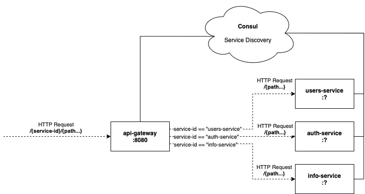

# Локальный запуск
### Установка и запуск Consul



```shell
wsl docker pull consul
```
```shell
wsl docker run -p 8500:8500 consul
```

### Установка и запуск Kafka

```shell
wsl docker pull confluentinc/cp-kafka
wsl docker pull confluentinc/cp-zookeeper
```

```shell
cd docker/kafka
wsl docker-compose up
```