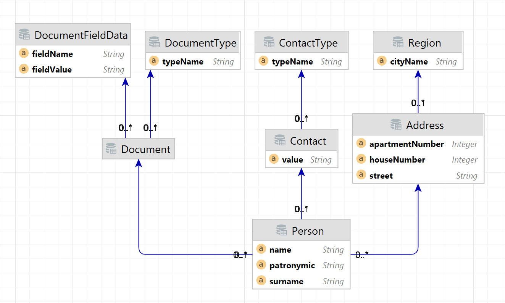

## API
``` json
{
    "api": {
        "POST /person": "создание данных о гражданине",
        "PUT /person": "редиактирование данный о гражданине, возможность скрыть его из общего списка",
        "GET /person/{id}": "получить данные о гражданах постранично в формате: id, ФИО, дата рождения, телефон, данные о основном документе, адрес регистрации,
        "GET /person?region={region}", "возможность фильтрации по региону",
        "GET /person/verify?name=...&passport=...", "проверrf валидности связки ФИО+паспорт"
    }
}
```

## DOMAIN

